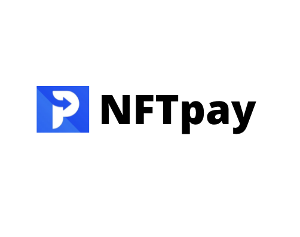

    

NFTpay

###

Make your own blockchain-hosted invoices - hosted for free on IPFS and fulfilled by cryptocurrency.

Built for the NFThack2022 hackathon.

### Benefits

- Free hosting for invoice checkout pages.
- No need to open a partnership with an external vendor for managing invoices, or paying vendor-specific fees such as those from Stripe.
- Receipts auto-hosted as NFT's. No chance of losing an attachment or document showing the time and receipt of purchase. Receipt and time of purchase forever retained on ethereum's network.
- Payments facillated and settled on crypto. Use either credit card or your ERC20 token of choice to settle the payment.
- On successful payment callback, receipts represented as NFTs are delivered by the app to both the buyer and seller wallets after the transaction.

### Technologies used

#### Invoice hosting/generation

- IPFS/Filecoin: Hosting of the invoice metadata on IPFS with it's own NFT contract. Invoice metadata saved in a static IPFS-served json file.

#### Payments/Checkout

- Unlock Protocol: Creates an ethereum based paywall where a user chooses an Ethereum wallet as the checkout method of choice.
- Circle: Enables settling transactions in USDC using credit card directly from the invoice checkout screen.

#### NFT Receipts

- Covalent: Transaction history / lookup. After transactions are completed, Covalent can be used for destination address lookup to view the history on a particular network in a user-friendly table format in-app
- NFTPort: Creation of the NFT payment receipts for arbitrary addresses and blockchains (Filecoin could have potentially been used as well).

### Running the project

<b>This project is a hackathon prototype and would require additional work to be production ready (i.e. around some of the final checkout flows).</b>

To run/demo the project locally, NFTpay requires the following environment variables.

<pre>
    REACT_APP_NFT_KEY={YOUR_NFT_STORAGE_KEY} # NFT storage key for IPFS.
    REACT_APP_COVALENT_KEY={YOUR_COVALENT_API_KEY} # Covalent key for the history page.
    REACT_APP_NFT_PORT_KEY={YOUR_NFT_PORT_API_KEY} # NFT port api key for receipt creation.
</pre>

After declaring the above environment variables, use the below command to start the project:

`yarn && yarn start`

###

### Deployment

<!-- https://surge.sh/ -->

- nftpay.surge.sh

### Example Invoice

Use cid: bafyreifxtpw5sgtpvpc5r5ltyhhxtgikxcwyba7rx2wayvvgb7gh7bfhva
`/pay/{cid}`

<!--

### Sponsors:
Circle - payments USDC
IPFS/Filecoin - hosting
Unlock - payment wall
Covalent - hostin
Opensea? (might not qualify)
Moralis? - payments

Demo flow:
* Stripe page - invoicing requires account and accepting cash payment
NFTpay
* Receipts without any centralized party
* No need for hosting

-->

### Useful links

- https://app.unlock-protocol.com/dashboard
- https://showcase.ethglobal.com/nfthack2022/prizes
- https://stripe.com/invoicing
